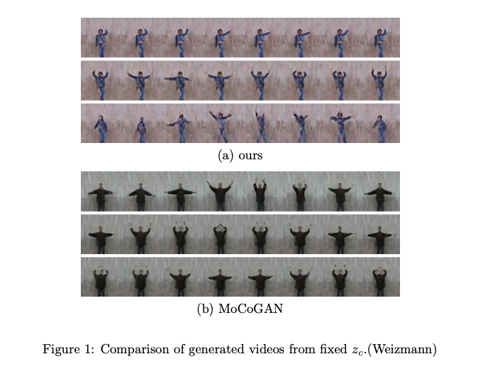
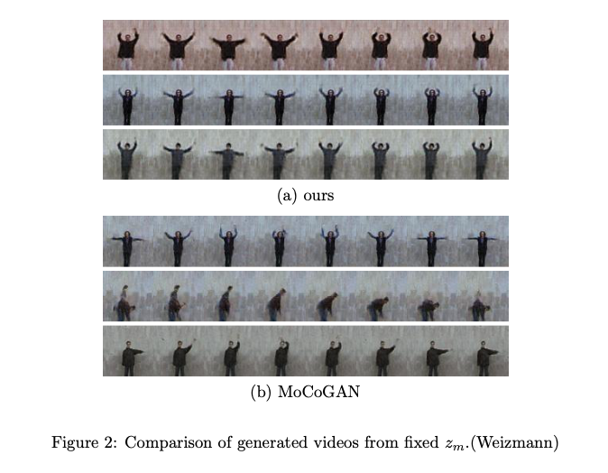
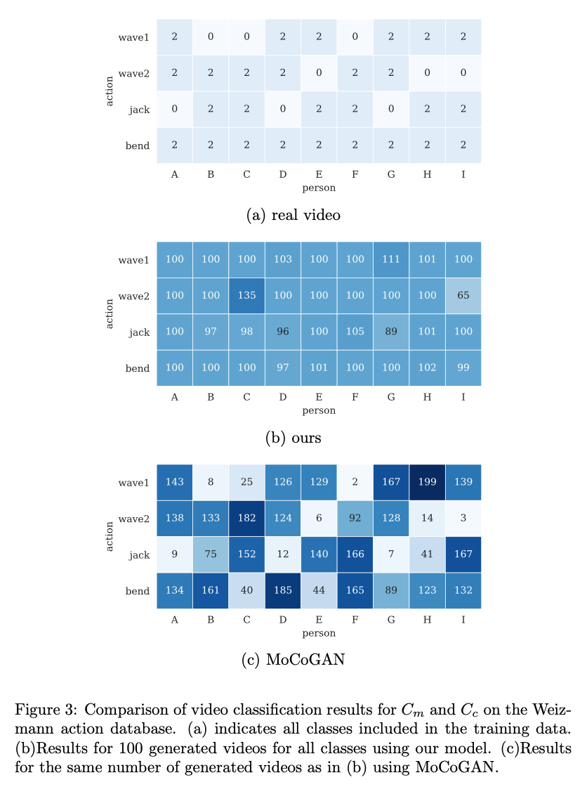
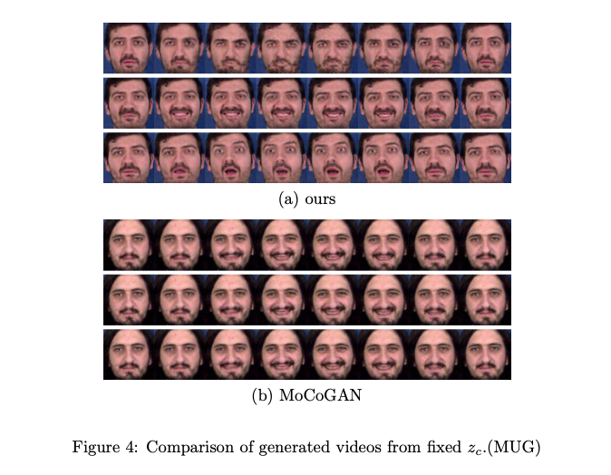
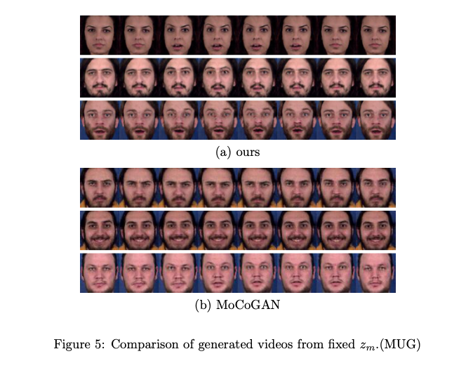
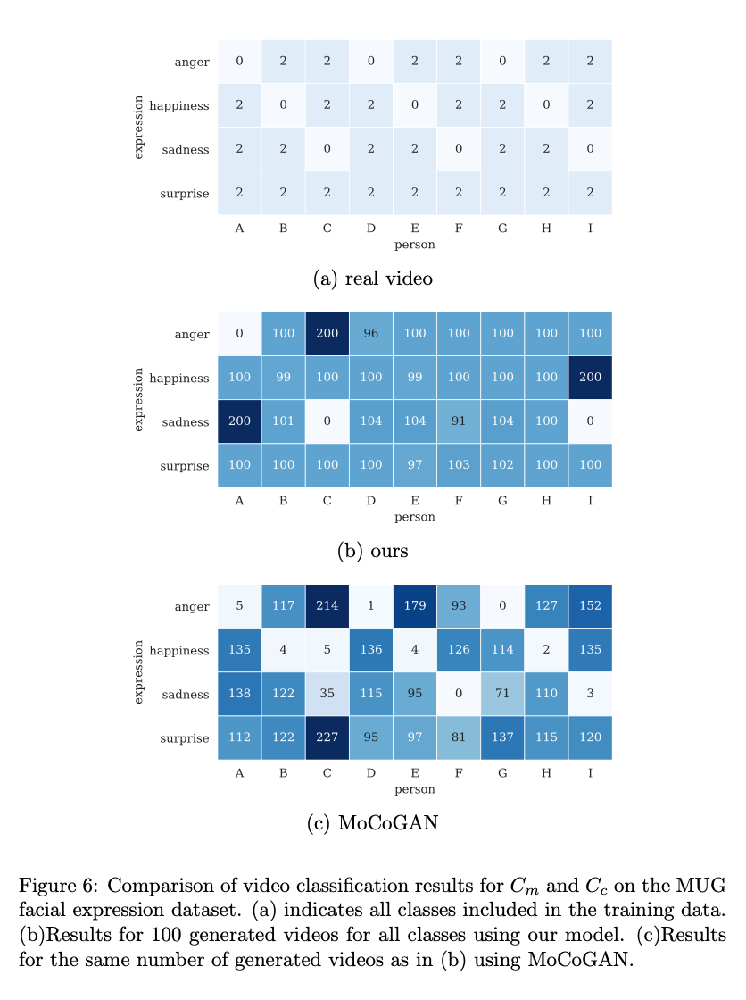

# Conditional-MoCoGAN

# Requirements
```
Python 3.7.3
CUDA 10.1
```
and [requirements.txt](requirements.txt).

# Experimental Results
## Weizmann action database
### Qualitative Evaluation
|                       |                       |
| --------------------- | --------------------- |
|  |  |

### Quantitative Evaluation
|                       |
| --------------------- |
|  |

## MUG facial expression dataset
### Qualitative Evaluation
|                       |                       |
| --------------------- | --------------------- |
|  |  |

### Quantitative Evaluation
|                       |
| --------------------- |
|  |
